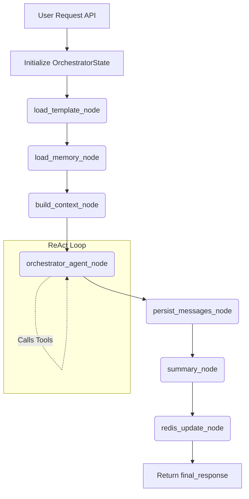

# Main Agent Pipeline

The `MainAgent` module implements the core orchestration engine that handles live user conversations for a finalized AI assistant. It manages context assembly, memory loading, tool execution (ReAct loop), message persistence, and conversation summarization via a linear LangGraph pipeline.

Unlike traditional agents, it uses a completely stateless graph execution model. All state is hydrated from Redis/PostgreSQL at the start of a turn and persisted back at the end.

Here is an overview of the pipeline's architecture and execution flow.

## 1. Graph State (`state.py`)

The pipeline revolves around `OrchestratorState`, a `TypedDict` that carries data through the nodes:
- **Request Context**: `template_id`, `user_id`, `conv_id`, `user_prompt`, `if_attachment`
- **Template Config**: `behavior_prompt`, `custom_tool_information`
- **Conversation Memory**: `summary`, `recent_messages`, `unsummarized_token_count`, `last_summarized_message_seq`
- **Agent Messages**: A list of LangChain `Message` objects (managed via an `add_messages` reducer).
- **Outputs**: `final_response` and `tools_called`.
- **Persistence Tracking**: Assigned sequence numbers for newly saved messages.

## 2. API Entry Point (`service.py`)

The `chat` function is the asynchronous entry point for the frontend API.
It initializes the `OrchestratorState`, injects identity context (`user_id`, `conv_id`) into LangChain's `RunnableConfig` (for downstream tools), and runs `graph.ainvoke()`. A `chat_debug` function also exists to return which tools were invoked during the turn.

## 3. Pipeline Nodes (`graph.py`)

The LangGraph pipeline is strictly linear, executing the following nodes in order:

### 1. `load_template_node`
Fetches the template configuration (`behavior_prompt` and `custom_tool_information`) from Redis, falling back to PostgreSQL on a cache miss.

### 2. `load_memory_node`
Loads conversation memory for the specific `conv_id` from Redis/PostgreSQL. This includes the running `summary` and the `recent_messages`.

### 3. `build_context_node`
Uses the helpers in `prompts.py` to assemble a massive, structured System Prompt. It injects:
- Core orchestrator instructions.
- Template-specific behavior instructions.
- Custom tool descriptions.
- Conversation summary.
- Recent conversation history.
- Attachment status (enforcing retrieval tool usage if files are present).

### 4. `orchestrator_agent_node`
The core ReAct loop. The LLM processes the user prompt, context, and available tools. It can iterative call tools (e.g., Web Search, Document Retrieval, Custom Tool Subagent) up to 10 times. Once it has enough information, it generates the `final_response`. It also logs the ordered list of `tools_called`.

### 5. `persist_messages_node`
Persists the raw user message and the raw assistant message to the PostgreSQL database, assigning them incrementing sequence numbers.

### 6. `summary_node`
Conditionally compresses the conversation history. If the `unsummarized_token_count` exceeds a certain threshold, a secondary LLM call (guided by `SUMMARIZATION_SYSTEM_PROMPT`) generates an updated running summary, and the token counter is reset.

### 7. `redis_update_node`
Writes the newly generated messages, the updated summary, and the token counts back to the Redis cache, ensuring the next turn can load memory instantly.

## Flow Diagram

