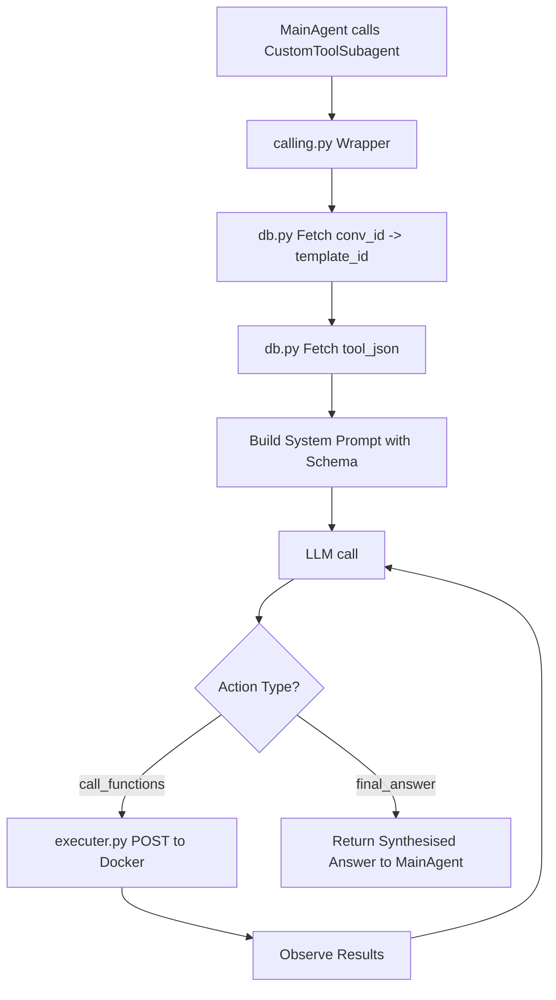

# Custom Tool Subagent Pipeline

The `CustomToolSubagent` module is an autonomous, ReAct-style subagent that executes within the `MainAgent` pipeline. It is responsible for fulfilling user requests that require the custom tools generated during the `TemplateCreation` and `ToolGeneration` phases.

It operates entirely autonomously once invoked, discovering the correct tool schema dynamically from the database using the conversation ID.

Here is an overview of its architecture and execution flow.

## 1. Tool Wrapping and Invocation (`calling.py`)

The main entry point exposed to the `MainAgent` is `call_custom_tool_subagent`, a LangChain `@tool`-decorated function. 
When the `MainAgent` decides it needs to use a custom tool, it calls this function, passing a natural-language description of the task (`query`) and a context object containing the `conv_id`. 

The `MainAgent` does **not** need to know the specific function signatures of the custom tools; it just delegates the broad task to this subagent.

## 2. Dynamic Schema Resolution (`db.py`)

Upon invocation, the subagent performs a two-step database lookup:
1. **Get Template**: Uses the `conv_id` to query the `Conversations` table and find the associated `template_id`.
2. **Get Tool Schema**: Uses the `template_id` to query the `Tools` table and fetch the latest `tool_json` schema, which contains the definitions of the custom Python functions available for this template.

## 3. The ReAct Agent Loop (`agent.py`)

With the tool schema loaded, the subagent enters a ReAct (Reason + Act) loop, managed entirely via standard LLM chat history (no LangGraph is used here).

1. **System Prompt**: It builds a system prompt embedding a summary of the available functions (names, descriptions, parameters, expected return types).
2. **LLM Invocation**: It passes the user's `query` to the Groq LLM (`openai/gpt-oss-120b`). The LLM is strictly instructed to return only a JSON object with one of two actions: `call_functions` or `final_answer`.
3. **Execution (`executer.py`)**: If the LLM chooses `call_functions`, the requested calls are forwarded to the isolated Docker executor (`execution_call()`).
4. **Observation**: The JSON results (or error traces) from the Docker container are fed back into the LLM's chat history as a "user" observation message.
5. **Iteration**: The LLM reviews the results and either calls more functions, retries with different parameters, or proceeds to formulate the final answer. The loop enforces a maximum of 6 iterations to prevent infinite cycles.

## 4. Final Output

Once the LLM outputs a `final_answer` JSON object, the loop terminates. The final synthesized answer string is extracted and returned to the `MainAgent`, which incorporates it into the final response to the user.

## Flow Diagram

