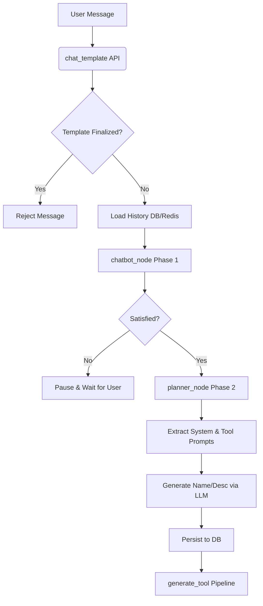

# Template Creation Pipeline

The `TemplateCreation` module implements a two-phase LangGraph pipeline designed to gather requirements from a user through an interactive chat, and then automatically compile those requirements into a custom AI assistant template. 

The pipeline does not use LangGraph's built-in checkpointer; instead, it manually manages conversation memory using Redis (for fast caching) and PostgreSQL (as the source of truth).

Here is an overview of the pipeline's architecture and execution flow.

## 1. Graph State (`state.py`)
The entire process revolves around a shared `GraphState` (a `TypedDict`) that flows between nodes:
- `messages`: Full conversation history between the user and the requirements gathering chatbot.
- `phase`: Current workflow phase (`gathering`, `planning`, or `done`).
- `satisfied`: A boolean flag indicating whether the chatbot has gathered enough information.
- `tool_creation_prompt`: A detailed prompt for tool generation (populated in Phase 2).
- `system_prompt`: The final behavioral system prompt for the resulting AI assistant (populated in Phase 2).

## 2. API Entry Point (`service.py`)

The main entry point for the frontend API is the `chat_template` function in `service.py`.

### Step-by-Step Flow:
1. **Validation**: Checks if the template is already finalized. If so, rejects the chat turn.
2. **History Hydration**: Loads previous conversation history from Redis (falling back to PostgreSQL on cache miss).
3. **Message Persistence**: Saves the new user message to the database and appends it to the cache.
4. **Graph Execution**: Reconstructs the LangChain messages, initializes the `GraphState`, and compiles the `StateGraph` dynamically (via `graph.py`).
5. **Node Evaluation**: The graph executes starting at the `chatbot_node`.
6. **Automatic Transition**: If the graph completes and sets `satisfied=True`, it automatically proceeds to call `create_template()` (Phase 2) and `generate_tool()` (tool generation pipeline).

## 3. Phase 1: Requirements Gathering (`nodes/chatbot_node.py`)

- **Role**: Conversational Analyst.
- **Process**: Uses the `openai/gpt-oss-120b` Groq LLM guided by a `chatbot_system.txt` prompt. It asks the user probing questions to understand what kind of AI assistant they want to build.
- **Satisfaction Signal**: The node monitors the LLM's response for a hidden `[REQUIREMENTS_COMPLETE]` tag.
- **Outcome**: 
  - If the signal is absent, `satisfied` remains `False`, and the graph pauses to wait for the next user input.
  - If the signal is detected, the tag is stripped from the visible response, `satisfied` is set to `True`, and the state `phase` transitions to `"planning"`.

## 4. Phase 2: Planning and Artifact Generation (`nodes/planner_node.py` & `create_template`)

When `satisfied` becomes `True`, Phase 2 is triggered. It does not require a conversational turn; instead, `service.py` directly calls `planner_node` via the `create_template` function.

- **Role**: System Architect.
- **Process**: The node formats the *entire conversation transcript* into a single prompt for the Groq LLM (guided by `planner_system.txt`).
- **Outputs generated**: The LLM is instructed to generate two distinct, delimited outputs:
  1. **Tool Creation Prompt**: A detailed specification used by a downstream AI to write the Python code for necessary tools.
  2. **System Prompt**: The master prompt that governs the behavior of the final AI assistant template.
- **Extraction**: A utility (`extract_planner_outputs`) parses the LLM output to extract these two texts.

## 5. Finalization & Tool Generation

Back in `service.py`, `create_template()` completes the template creation process:
1. **Naming**: It uses a secondary, smaller Groq LLM call (`llama-3.3-70b-versatile`) to read the first 15 messages and automatically generate a short `name` and one-sentence `description` for the template.
2. **Persistence**: The final template details (name, description, tool creation prompt, system prompt) are saved to the PostgreSQL `Templates` table.
3. **Downstream Handoff**: `chat_template` concludes by invoking `generate_tool(template_id)` (from the `ToolGeneration` module), passing the baton to the tool generation pipeline which will use the newly crafted `tool_creation_prompt`.

## Flow Diagram

