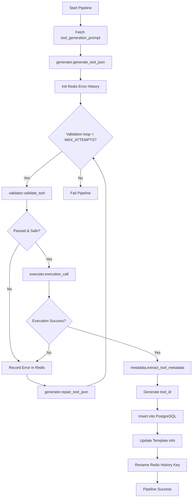

# Tool Generation Pipeline

The `ToolGeneration` module implements an autonomous, self-correcting pipeline that takes a natural language specification (a `tool_generation_prompt` from the `TemplateCreation` phase) and turns it into validated, executable Python code encapsulated in a JSON schema.

Here is an overview of the pipeline's architecture and execution flow.

## 1. Pipeline Orchestrator (`pipeline.py`)

The main entry point is the `generate_tool(template_id)` function, which orchestrates the entire process end-to-end. It manages up to 6 attempts to generate, validate, execute, and automatically repair the tool.

### Execution Flow:
1. **Fetch Template**: Retrieves the `tool_generation_prompt` for the given `template_id` from the PostgreSQL database.
2. **Generate Initial JSON**: Calls `generator.py` to generate the first draft of the `tool.json`.
3. **Initialize History**: Sets up a tracking key in Redis to track validation and execution errors. This error history provides context for the LLM if self-repair is needed.
4. **Validation & Execution Loop**: Repeatedly runs validation and execution tests. If any step fails, the pipeline requests a repair from the LLM and tries again.
5. **Extraction**: Once successful, `metadata.py` extracts a human-readable summary of the tool's capabilities.
6. **Persistence**: The tool is assigned a `tool_id` and saved to PostgreSQL. The corresponding template record is updated with the tool's metadata summary.

## 2. LLM Generation and Repair (`generator.py`)

This module handles communication with the Groq LLM (using `llama-3.3-70b-versatile`).

- **Initial Generation (`generate_tool_json`)**: Uses the system prompt (`SystemPrompt.py`) and the Pydantic `ToolSchema` to enforce a strict JSON output containing the Python code and metadata.
- **Self-Repair (`repair_tool_json`)**: If a tool fails validation or execution, this function sends the broken JSON, the error history from Redis, and the specific failing error back to the LLM. The LLM acts as an "expert Python debugger" to return a corrected JSON, along with bullet points explaining the cause of the failure and the fix applied.

## 3. Multi-stage Validation (`validator.py`)

Before any code is sent to execution, it must pass a rigorous 6-stage validation suite:
1. **Schema Integrity**: Checks for required fields, valid Python identifiers, and correct data types.
2. **Syntax Check**: Uses `ast.parse()` to ensure the generated Python code is syntactically correct.
3. **Static Safety**: Walks the Abstract Syntax Tree (AST) to block dangerous built-ins (e.g., `exec`, `eval`), system calls (e.g., `os.system`, `subprocess`), destructive file operations, and hardcoded secrets.
4. **Structural Match**: Ensures that the functions defined in the Python code perfectly match the functions declared in the JSON schema metadata.
5. **Dependency Check**: Verifies that requested dependencies (using `importlib.util.find_spec`) are resolvable.
6. **Sandboxed Dry-run**: Executes the code in a restricted local namespace with mocked network requests (`requests.get`, etc.) to verify that the functions execute without crashing and return the declared types.

## 4. Execution Testing (`executer.py`)

Once the tool passes local validation, it is sent to an isolated environment for a real execution test.
- `execution_call()` sends a `POST /execute` request to a separate Docker container (`Docker_exec`).
- The Docker container dynamically writes the code to a file, installs any required dependencies via pip, and executes the function with stub or example arguments.
- The result (or traceback) is returned. If it fails, the pipeline loops back to the repair stage.

## 5. Metadata Extraction (`metadata.py`)

Once a valid, working tool is confirmed, `extract_tool_metadata` scans the schema to build a structured, multi-line `tool_information` string. This string summarizes every function's inputs and outputs in plain text, making it easy for the orchestrating AI assistant to understand how to use the tool without parsing raw JSON.

## Flow Diagram

