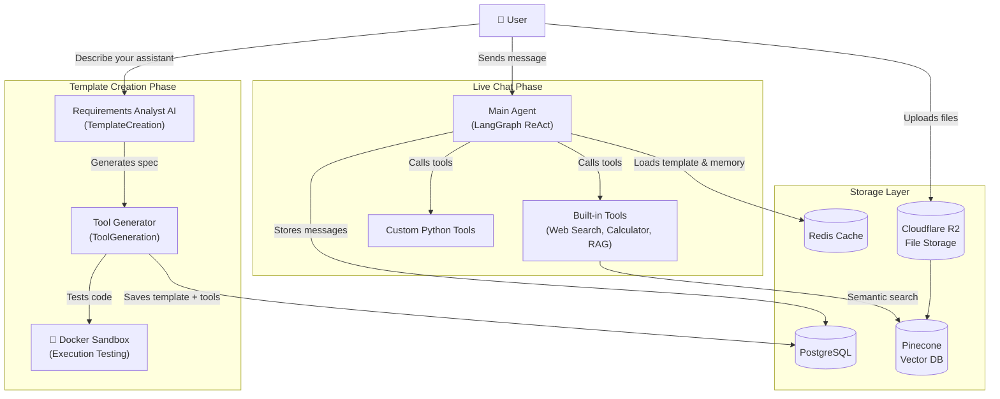

# AdapterAI — Project Explainer

## What is AdapterAI?

**AdapterAI** is a **multi-agent AI platform** that lets users build, deploy, and interact with fully customized AI assistants — without writing any code themselves.

Think of it as a **personal AI factory**: a user describes what kind of assistant they want through a guided chat interface, and the platform automatically creates a tailored AI agent, complete with its own behavior, personality, and custom Python tools — all ready to use.

---

## The Core Idea

Most AI tools give everyone the same, generic assistant. AdapterAI flips this model by making the AI itself *configurable*. Users don't just *use* an AI — they **create their own** AI assistant, tuned precisely to their domain and workflows.

> **"Describe what you need → AdapterAI builds it for you."**

---

## How It Works — The Three Pillars

### 🔷 1. Template Creation (Build Your Assistant)

The user starts a guided conversation with a **Requirements Analyst AI**. This bot asks intelligent, probing questions to understand:

- What domain the assistant will operate in
- How it should behave and respond
- What custom capabilities (tools) it will need

Once enough information is gathered, a second AI — the **System Architect** — takes over and silently generates:
- A **System Prompt**: the master behavioral instructions for the new AI
- A **Tool Creation Prompt**: a detailed spec describing the Python tools to build

The template is named, described, and saved to the database automatically.

---

### 🔷 2. Tool Generation (Build the Tools)

Once a template is created, the platform autonomously writes and validates the **custom Python tools** the assistant will need.

This pipeline is fully self-healing:

| Stage | What Happens |
|---|---|
| **Generate** | An LLM writes Python code from the tool spec |
| **Validate** | 6-stage safety & correctness checks (syntax, safety scan, dependency check, dry-run, etc.) |
| **Execute** | Code is tested in a real, isolated Docker container |
| **Repair** | If anything fails, the LLM debugs and fixes its own code (up to 6 attempts) |
| **Persist** | Verified tools are saved to PostgreSQL with metadata summaries |

The result is a set of reliable, executable Python tools attached to the user's template.

---

### 🔷 3. Main Agent (Use Your Assistant)

Once a template is finalized, users can start chatting with their custom AI assistant. The Main Agent handles every live conversation:

- Loads the user's custom **behavior prompt** and **tools** from cache (Redis)
- Loads the **conversation memory** (recent messages + a rolling summary)
- Assembles the full context and runs a **ReAct loop** — the LLM reasons and calls tools iteratively (up to 10 tool calls per turn) before giving a final answer
- Saves every message and updates the memory cache

---

## Supporting Systems

### 📁 Document Intelligence (RAG Pipeline)
Users can **attach files** to their conversations. The platform handles:
- **PDFs & DOCX** → text extraction
- **Images** → AI vision (LLaVA) describes them
- **Audio** → AI speech-to-text (Whisper) transcribes them

All content is chunked, embedded via Cloudflare AI, and stored in **Pinecone** vector database. The assistant then retrieves relevant passages semantically to answer questions grounded in the user's documents.

### 🌐 Built-in Tools
Every assistant has access to:
- **Web Search** — real-time internet lookups
- **Document Retrieval** — querying the user's uploaded files
- **Calculator** — precise mathematical computations

### ⚡ Infrastructure
| Component | Purpose |
|---|---|
| **FastAPI** | REST API backend |
| **PostgreSQL** | Persistent storage (users, templates, tools, messages) |
| **Redis** | Low-latency cache for templates and conversation memory |
| **Pinecone** | Vector database for semantic document search |
| **Cloudflare R2** | File storage for uploaded attachments |
| **Docker** | Isolated sandbox for executing generated tool code |
| **LangGraph** | Agent pipeline orchestration framework |

---

## Architecture Overview

---

## Summary

AdapterAI is a **full-stack, autonomous AI platform** that turns a natural language description into a fully functional, custom AI assistant — complete with memory, tool use, document understanding, and web search. It bridges the gap between generic AI chatbots and purpose-built AI systems, making sophisticated AI customization accessible to anyone.
