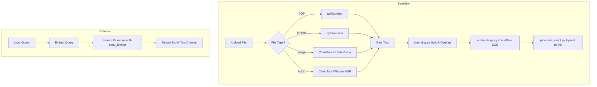

# Vector Store Pipeline

The `vector_store` module manages the complete Retrieval-Augmented Generation (RAG) pipeline for the platform. It handles the ingestion of user-uploaded files, converts them into text, generates embeddings, stores them in Pinecone, and retrieves semantically relevant context during conversations.

Here is an overview of its architecture and execution flow.

## 1. File Ingestion & Extraction (`ingest.py`)

The pipeline accepts a variety of file formats and extracts the underlying text. It relies on standard python libraries for documents and Cloudflare AI Workers for rich media:

- **PDFs**: Extracted using `pdfplumber`.
- **DOCX**: Extracted using `python-docx`.
- **Images (OCR/Vision)**: Sent to Cloudflare's `@cf/llava-hf/llava-1.5-7b-hf` model to extract visible text or generate a detailed description of the image.
- **Audio (ASR)**: Sent to Cloudflare's `@cf/openai/whisper-large-v3-turbo` model for speech-to-text transcription.

## 2. Text Chunking (`chunking.py`)

The raw extracted text is split into manageable, overlapping chunks to ensure context is not lost across boundaries.
- **Strategy**: Greedily splits text by sentences and merges them into blocks up to a target character limit.
- **Defaults**: Chunks of up to 512 characters, with an overlap of 64 characters between adjacent chunks.

## 3. Embedding Generation (`embeddings.py`)

The chunks are converted into dense vector representations.
- Uses Cloudflare AI's `@cf/baai/bge-base-en-v1.5` model.
- Automatically batches requests (up to 100 texts per request) to stay within API limits.
- Produces 768-dimensional float vectors for each text chunk.

## 4. Vector Storage (`pinecone_client.py`)

The resulting embeddings are pushed to a serverless Pinecone index.
Each vector is saved with critical metadata to ensure strict access control:
- `user_id`: To securely isolate user data.
- `conv_id`: To scope documents to a specific conversation.
- `text`: The original text chunk.
- `source`: The filename.

## 5. Semantic Retrieval (`retrieve.py`)

During a conversation, the `MainAgent` (if an attachment is present) queries the vector store to ground its answers.
1. The user's search query is passed to `embeddings.py` to generate a 768-d query vector.
2. The vector is sent to `pinecone_client.py` using `user_id` and `conv_id` as strict metadata filters.
3. The top `k` most semantically similar chunks (based on cosine similarity) are returned and injected into the LLM's context window.

## Flow Diagram

